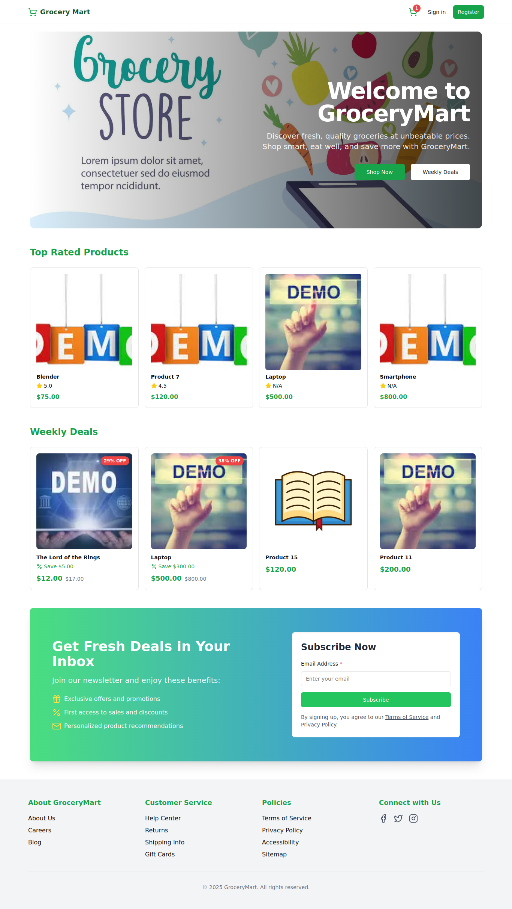

# GroceryMart

GroceryMart is a modern, responsive web application designed to streamline grocery shopping. It features real-time inventory management, secure checkout, and an easy-to navigate interface, making it suitable for both end-users and administrators.

## Features
- **Responsive Design:** Optimized for mobile and desktop.
- **Real-Time Inventory:** Automatically updates product availability.
- **Secure Checkout:** Reliable payment integration.
- **Admin Dashboard:** Effortlessly manage products and track orders.

## Screenshot
Below is a preview of the home screen of GroceryMart:


## Installation
1. **Clone the Repository:**
    ```
    git clone https://github.com/yourusername/GroceryMart.git
    ```
2. **Navigate to the Project Directory:**
    ```
    cd GroceryMart
    ```
3. **Install Dependencies:**
    - For Node.js projects: `npm install`
    - For Python projects: `pip install -r requirements.txt`  
    (Customize according to your project setup.)

## Usage
- **Start the Application:**
  - For Node.js projects: `npm run dev`
  - For Python projects: `python manage.py runserver`
- **Open in Browser:** Visit `http://localhost:3000` (or the port specified in your configuration).
- **Admin Dashboard:** Access the admin panel at `http://localhost:8000/admin`.

## Contributing
Contributions are welcome! Please follow these steps:
1. Fork the repository.
2. Create a new branch for your feature or bug fix.
3. Submit a pull request with a clear description of your changes.

## License
This project is licensed under the MIT License. See the [LICENSE](LICENSE) file for details.

Happy coding!
